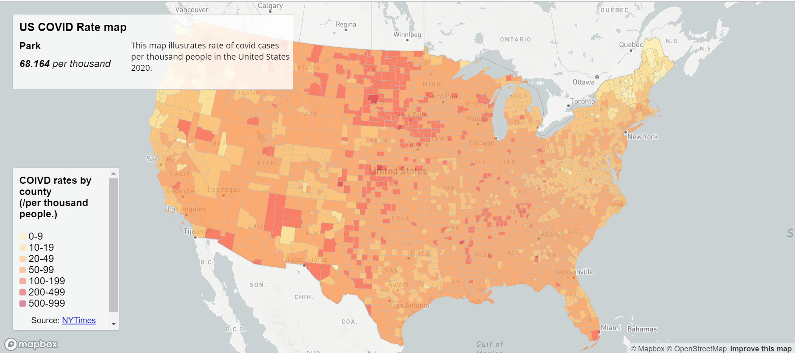
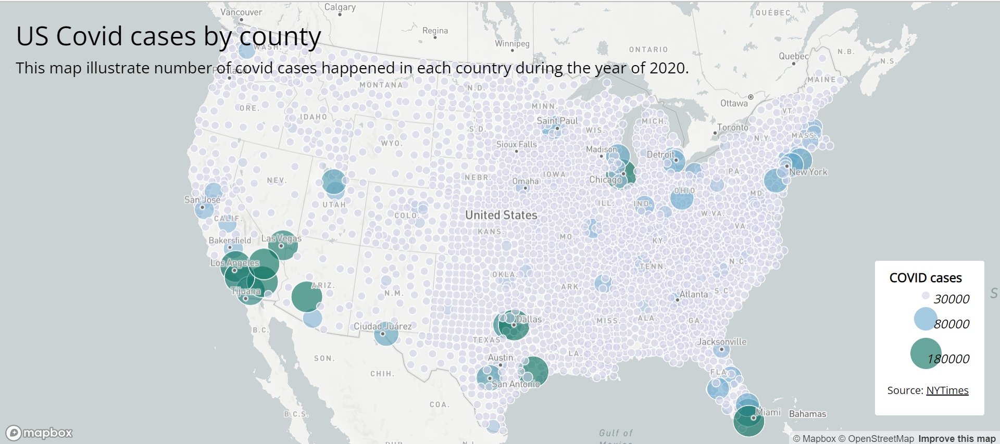

# US_COVID_MAPS_lab
## Project decription: 
For this project, we used the data from the New York Times to create two different maps about COVID-19 cases in 2020. I created Choropleth map about rate of covid cases per thousand people for each country and proportinal symbol map about total number of cases of covid by each county. Map 1.html stored the choropleth map about covid rates and map2.html stored proportional symbol map about covid cases.

[Map 1](http://127.0.0.1:5555/map1.html)

[Map 2](http://127.0.0.1:5555/map2.html)
### Technical side of project: 
To build those maps, I used the mapbox library and create two different interactive maps. The use of language is html, java script, and css. 
For some intereactive features of the maps, I add some hover features that if you hover over the specific point of the map, you can see the detailed information about that point. And for Map 2, I add click feature that if you click on the circle that is representing the size of the cases, you can see the detail about county too. 
### Summary 
From the result of the map, both maps representing inverse result from the data. Map 1 illustrates that central part of the United States tend to have higher density of high rates county. However, Map 2 illustrates that coast side of the United States have higher proportion of number of COVID cases. This means, central part had higher number of covid cases but because of population, it seems like central part seems safer which is not accurate information. 
### Source: 
This data is provided by the New York Times. And this projected is hosted by Jo Inoue. 